# 数据结构与算法

## 逻辑结构

> 逻辑结构是指数据对象中每一个元素之间的互相关系

1. 集合结构

   > 集合结构中的数据元素除了同属一个集合外，他们直接没有互相关系，每一个元素互相平等，他们的共同点：同属一个集合

   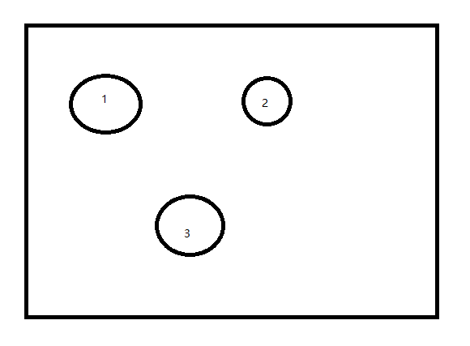

2. 线性结构

   > 线性结构中的元素之间是一一对应

   

3. 树形结构

   > 树形结构中的元素之间存在一对多的关系

   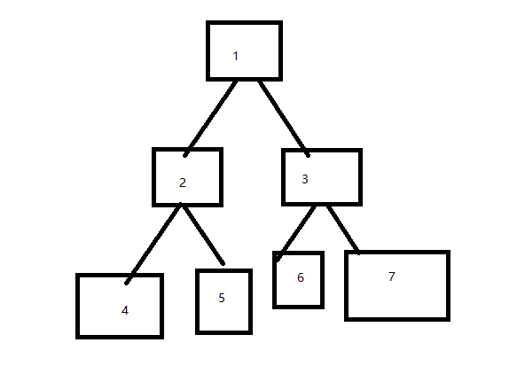

4. 图结构

   > 图结构中的元素是多对多关系

   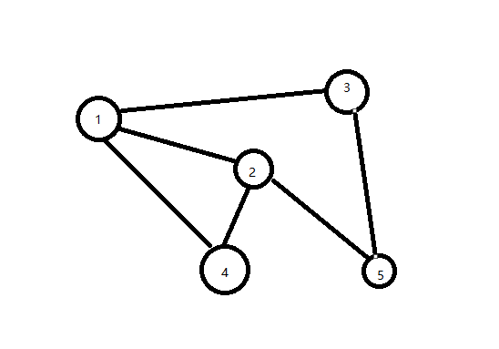

## 物理结构

1. 顺序存储结构
   - 顺序储存结构是将元素放在地址连续的储存单元中，元素之间的逻辑关系和物理关系相同
   - 
2. 链式存储结构
   - 链式存储结构是将元素放在任意储存单元内，举个例子医院排队，等待阶段并不在乎你在那里等待，只需要叫到你过去即可

## 算法

### 特性

1. 输入
   - 0个或多个输入内容
2. 输出
   - 必须要有输出
3. 有穷性
   - 算法在执行有限的步骤后，自动结束，每一个步骤在可接受的时间内完成
4. 确定性
   - 算法的每一个步骤都有明确的含义，不会出现二义性
5. 可行性
   - 每一步都能够通过一定量的执行获得结果


### 设计要求

1. 正确性
   - 明确输入，输出是什么
   - 加工处理没有歧义
   - 正确反映问题需求
   - 得到的结果复合需求
2. 可读性
3. 健壮性
   - 对输入不合法的数据进行处理
4. 时间效率低&存储量低

### 效率的度量

#### 大o表示法从小到大排列

| Big-O      | 名称       | 描述                      |
| ---------- | ---------- | ------------------------- |
| O(1)       | 常数级     | 最好 。实例：数组索引     |
| O(log(n))  | 对数级     | 相当好。实例：二分查找    |
| O(n)       | 线性级     | 实例：for循环遍历线性查找 |
| O(nLog(n)) | 线性对数级 | 实例：排序算法            |
| O(n^2)     | 二次方级   | 实例：旅行商问题          |
| O(n!)      | 阶乘级     | 不推荐！极慢              |

#### 

## 线性表

### 定义

- 0个或多个数据元素的有限序列。线性表是一个序列，元素之间有顺序，第一个元素没有前驱，左后一个元素没有后继，中间每一个元素有且只有一个前驱和后继。

### 抽象数据结构

```
ADT 线性表(List)

Data
	线性表的数据对象集合为{a_1,a_2,...,a_n},每一个元素的类型均为DataType。其中，除第一个元素a_1外，每一个元素有且只有一个前驱元素，除了最后一个元素a_n外，每一个元素有且只有一个后继元素，元素之前的关系是一对一。
	
	
operation
	InitList(*L):	初始化操作，建立一个空的线性表L
	ListEmpty(L):   若线性表为空，返回true，否则返回false
	ClearList(*L):  将线性表清空
	GetElem(L,i,*e): 将线性表L中的第i个位置的元素返回给e
	LocateElem(L,e): 在线性表L中查找与给定值e相等的元素，如果查找成功，返回该元素在表中的序号，表示成功，否则返回-1，表示失败。
	ListInsert(*L,i,e): 在线性表L中的第i个位置元素插入新元素e
	ListDelete(*L,i,*e): 删除线性表L中第i个位置元素，用e接收返回值
	ListLength(L):    返回线性表L的元素个数

endADT
```


### 线性表的顺序存储结构

#### 定义

- 用一段地址连续的存储单元依次存储线性表的数据元素

数据长度和线性表长度

- 数据长度是指存放线性表的存储空间的长度，这个值在线性表初始化后不再更改
- 线性表长度，是指表中数据元素的个数，随着插入、删除操作该值会修改


#### 操作

本文使用JAVA中AarrayList作为案例

- 创建

```java
private static final Object[] DEFAULTCAPACITY_EMPTY_ELEMENTDATA = {};
transient Object[] elementData;
// 无参构造，制造一个Object数组
public ArrayList() {
    this.elementData = DEFAULTCAPACITY_EMPTY_ELEMENTDATA;
}
// 有参构造 ，制造一个指定长度的new Object[initialCapacity]的数组
public ArrayList(int initialCapacity) {
        if (initialCapacity > 0) {
            this.elementData = new Object[initialCapacity];
        } else if (initialCapacity == 0) {
            this.elementData = EMPTY_ELEMENTDATA;
        } else {
            throw new IllegalArgumentException("Illegal Capacity: "+
                                               initialCapacity);
        }
    }
```

- 获取

线性表通过下表索引来获取，输入的索引需要小于等数组长度size。下面举例说明java中ArrayList的get方法

```java
public E get(int index) {
    rangeCheck(index);

    return elementData(index);
}

// 进行校验是否小于size
private void rangeCheck(int index) {
        if (index >= size)
            throw new IndexOutOfBoundsException(outOfBoundsMsg(index));
    }

    E elementData(int index) {
        return (E) elementData[index];
    }
```

- 插入

- 指定索引处追加，将输入数据插入到指定位置，在指定位置后的每一个元素索引+1后移一位

  ```java
  // 指定索引位置追加    
  public void add(int index, E element) {
          rangeCheckForAdd(index);
  
          ensureCapacityInternal(size + 1);  // Increments modCount!!
          System.arraycopy(elementData, index, elementData, index + 1,
                           size - index);
          elementData[index] = element;
          size++;
      }
  
  // 尾部追加
  public boolean add(E e) {
      ensureCapacityInternal(size + 1);  // Increments modCount!!
      // size+1
      elementData[size++] = e;
      return true;
  }
  
  	// 计算扩容问题
      private void ensureCapacityInternal(int minCapacity) {
          ensureExplicitCapacity(calculateCapacity(elementData, minCapacity));
      }
  
  	// 
      private void ensureExplicitCapacity(int minCapacity) {
          // 当前列表的操作次数
          modCount++;
  
          // overflow-conscious code
          if (minCapacity - elementData.length > 0)
              grow(minCapacity);
      }
  
      private void grow(int minCapacity) {
          // overflow-conscious code
          int oldCapacity = elementData.length;
          // 新的长度 原长度上扩容1.5倍
          int newCapacity = oldCapacity + (oldCapacity >> 1);
          if (newCapacity - minCapacity < 0)
              newCapacity = minCapacity;
          if (newCapacity - MAX_ARRAY_SIZE > 0)
              newCapacity = hugeCapacity(minCapacity);
          // minCapacity is usually close to size, so this is a win:
          elementData = Arrays.copyOf(elementData, newCapacity);
      }
  ```

  

- 删除

- 输入索引删除当前索引的值，该索引后的值每一个索引-1向前移动

```java
public E remove(int index) {
    rangeCheck(index);

    modCount++;
    E oldValue = elementData(index);

    int numMoved = size - index - 1;
    if (numMoved > 0)
        System.arraycopy(elementData, index+1, elementData, index,
                         numMoved);
    // size -1
    elementData[--size] = null; // clear to let GC do its work

    return oldValue;
}
```

#### 优缺点

- 优点

- 元素间的逻辑关系不需要用额外的储存空间来保存
- 快速获取线性表中任一位置的元素

- 缺点

- 插入、删除操作需要移动大量元素
- 线性表长度变化较大时，存储空间的容量难以确认


### 线性表链式存储结构

#### 定义

- 为了表示每一个数据元素a<sub>i</sub>与其直接后继元素a<sub>i+1</sub>之间的逻辑关系，对元素a<sub>i</sub>来说，除了存储本身信息外还需要存储一个知识其直接后继元素的信息。我们把存储数据元素信息的域称谓数据域，把存储直接后继位置的域称为指针域。指针域中存储的信息乘坐指针，由这两部分信息组成的数据元素称之结点
- n个结点链接成一个连表，即为线性表的链式存储结构，链表的每一个结点只包含一个指针域，称之为单链表
- 链表中的第一个结点的存储位置叫做头指针，头指针的数据域不存放数据，只存放只想第一个数据元素的地址


- 头指针
  - 图中0001就是头指针
  - 头指针是指链表只想第一个结点的指针，若链表有头结点，则是指向头结点的指针
  - 头指针具有标识作用
  - 无论链表是否为空，头指针均不能为空，头指针是链表的必要元素
- 头结点
  - 头结点是为了操作的统一和方便而设立，放在第一个元素结点之前，其数据域一般没有实际意义
  - 有了头结点，对在第一个元素结点前插入和删除第一个元素结点，做了统一
  - 头结点不一定是链表的必须要素

#### 单链表操作

1. 插入

   1. 头部插入&尾部插入

      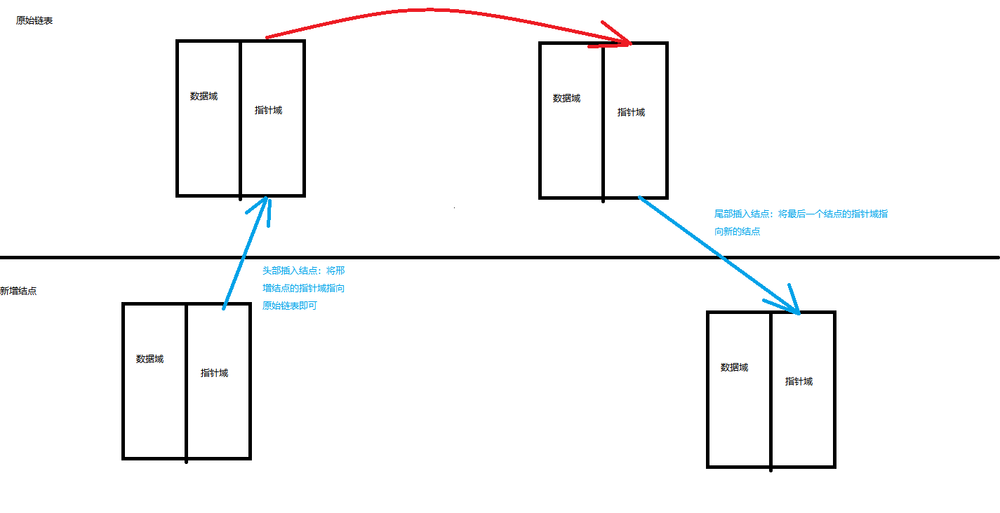

   2. 中间插入

      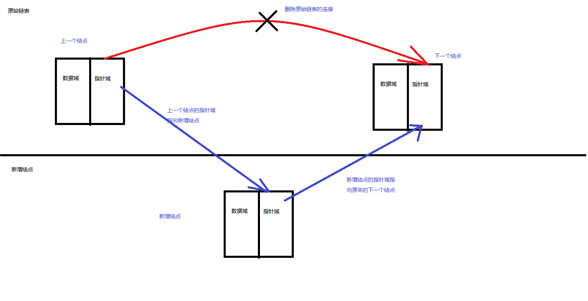

2. 删除

   1. 头结点删除&尾结点删除

      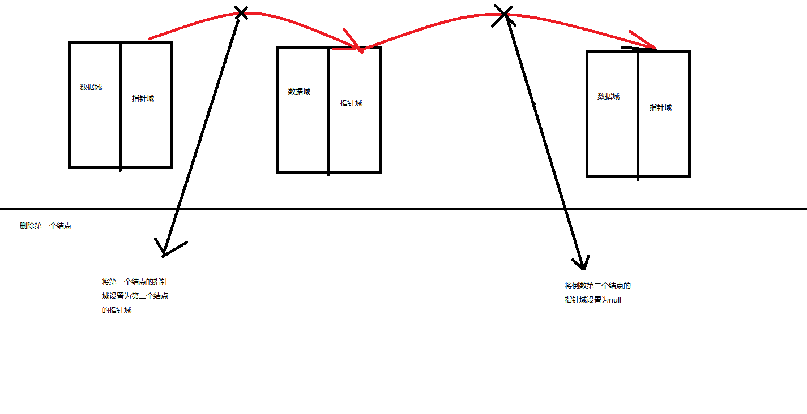

   2. 中间删除

      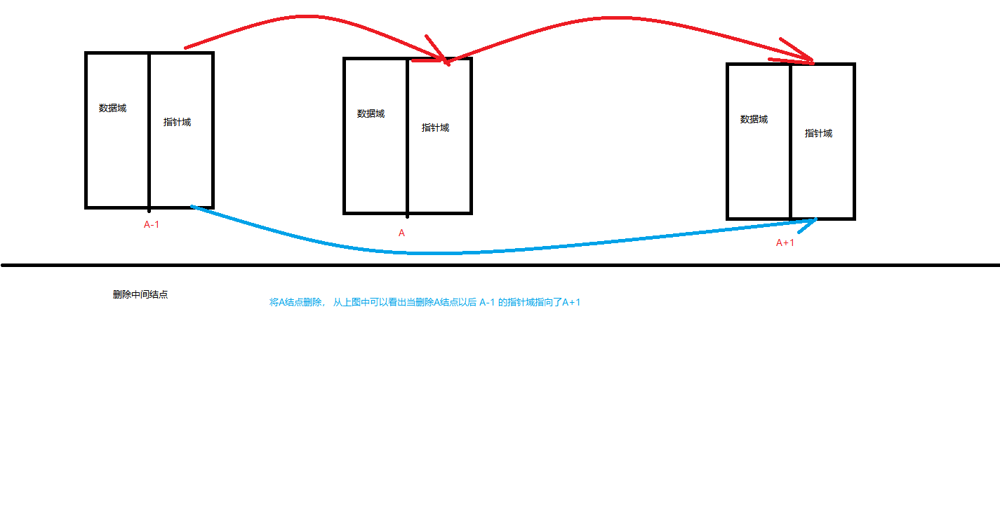


```java
/**
 * <p>Title : Node </p>
 * <p>Description : 单向链表结点</p>
 *
 * @author huifer
 * @date 2019-04-16
 */
public class Node {

    /**
     * 数据
     */
    public int data;
    /**
     * 下一个结点
     */
    public Node next=null;
    public Node(int data, Node next) {
        this.data = data;
        this.next = next;
    }

    public Node() {
    }

    public Node(int data) {
        this.data = data;
    }
}
```

```java
/**
 * <p>Title : SingleLinkedList </p>
 * <p>Description : 单向链表</p>
 *
 * @author huifer
 * @date 2019-04-16
 */
public class SingleLinkedList {

    /**
     * 头结点
     */
    private Node head;

    /**
     * 尾结点
     */
    private Node tail;


    private int length;

    public static void main(String[] args) {
        SingleLinkedList s = new SingleLinkedList();
        s.insertLast(1);
        s.insertLast(2);
        s.insertLast(3);
        s.inster(100, 1);
//        Node node = s.deleteFirst();
//        Node node = s.deleteLast();

//        Node node = s.delete(1);
        Node node = s.get(1);
        System.out.println(node);
        s.print();
    }


    /**
     * 输出所有数据
     */
    public void print() {
        if (isEmpty()) {
            return;
        }
        Node cur = head;
        while (cur != null) {
            System.out.print(cur.data + "\t");
            cur = cur.next;
        }
        System.out.println();
    }


    /**
     * 根据索引获取数据
     * @param position 索引
     * @return
     */
    public Node get(int position) {
        int i = 0;
        Node cur = head;
        Node rs = null;
        while (cur != null) {
            if (i == position) {
                cur = cur.next;
                rs = cur;
                break;
            }
            i++;
        }
        return rs;
    }


    /**
     * 结点是否空
     */
    public boolean isEmpty() {
        return length == 0;
    }

    public int getLength() {
        return length;
    }

    /**
     * 向链表的最后追加一个结点
     */
    public Node insertLast(int data) {
        Node node = new Node(data);
        if (isEmpty()) {
            // 当链表是空的时候头尾都是本身
            head = node;
            tail = node;
        } else {

            // 尾部追加
            tail.next = node;
            tail = node;
        }
        length++;
        return node;
    }

    /**
     * 头部插入
     */
    public Node inertFirst(int data) {
        Node node = new Node(data);
        Node lastNode;
        lastNode = head;
        head = node;
        head.next = lastNode;
        length++;
        return node;
    }

    /**
     * 指定位置插入数据
     *
     * @param data 数据
     * @param position 指定索引
     */
    public Node inster(int data, int position) {
        if (position < 0) {
            throw new IndexOutOfBoundsException();
        }
        Node node = new Node(data);
        if (position == 0) {
            // 第一个位置插入
            inertFirst(data);
        } else if (isEmpty() || position >= getLength()) {
            // 最后一个位置插入
            insertLast(data);
        } else {
            // 中间部分插入
            // node的上一个结点
            Node cur = head;
            // node 的下一个结点
            Node nextNode = cur.next;
            for (int i = 1; i < getLength(); i++) {
                if (i == position) {
                    // 遍历结点 当i等于输入的目标位置后
                    // 上一个结点指向node
                    cur.next = node;
                    // node 的下一个结点只想 cur的下一个
                    node.next = nextNode;
                } else {
                    // 节点更新
                    cur = cur.next;
                    nextNode = cur.next;
                }
            }
            // 头尾追加都有length++
            length++;
        }

        return node;
    }

    public Node getHead() {
        return head;
    }

    public Node getTail() {
        return tail;
    }

    /**
     * 删除头结点
     */
    public Node deleteFirst() {
        if (isEmpty()) {
            throw new RuntimeException("没有节点 不能进行删除操作");
        }
        // 删除节点等于头
        Node deleteNode = head;
        // 头结点等于后续
        head = deleteNode.next;
        length--;
        return deleteNode;
    }

    /**
     * 从最后一个结点开始删除
     */
    public Node deleteLast() {
        Node deleteNode = tail;
        if (isEmpty()) {
            throw new RuntimeException("没有节点 不能进行删除操作");
        }
        if (length == 1) {
            head = null;
            tail = null;
        } else {
            Node lastNode = head;
            // 根据单向链表的描述，最后一个节点的指针域为null 作为结束
            while (lastNode.next != tail) {
                lastNode = lastNode.next;
            }
            tail = lastNode;
            tail.next = null;
        }
        length--;
        return deleteNode;
    }

    /**
     * 指定位置删除
     *
     * @param position 索引
     */
    public Node delete(int position) {
        if (isEmpty()) {
            throw new RuntimeException("没有节点 不能进行删除操作");
        }
        if (position < 0 || position > getLength() - 1) {
            throw new IndexOutOfBoundsException("下标越界");
        }
        if (position == 0) {
            return deleteFirst();
        } else if (position == getLength() - 1) {
            return deleteLast();
        } else {
            // 上一个元素
            Node lastNode = head;
            // 当前元素
            Node cur = lastNode.next;
            // 下一个元素
            Node nextNode = cur.next;

            for (int i = 1; i < getLength(); i++) {
                if (i == position) {
                    lastNode.next = nextNode;
                    break;
                } else {
                    lastNode = cur;
                    cur = nextNode;
                    nextNode = nextNode.next;
                }
            }
            length--;
            return cur;

        }

    }


    /**
     * 删除指定数据
     */
    public Integer deleteByData(int data) {
        if (isEmpty()) {
            throw new RuntimeException("没有节点 不能进行删除操作");

        }

        if (head.data == data) {
            deleteFirst();
            return data;
        } else if (tail.data == data) {
            deleteLast();
            return data;
        } else {
            // 上一个元素
            Node lastNode = null;
            // 当前元素
            Node cur = head;
            // 下一个元素
            Node nextNode = cur.next;

            while (cur != null) {
                if (cur.data == data) {
                    lastNode.next = nextNode;
                    length--;
                    return data;
                }
                if (nextNode == null) {
                    return null;
                } else {
                    lastNode = cur;
                    cur = nextNode;
                    nextNode = nextNode.next;
                }
            }

        }
        return null;


    }


}

```


#### 静态链表

##### 定义

- 静态链表使用数组形式保存 [数据，游标]如下表

| 索引 | 数据  | 下一个的索引 |
| ---- | ----- | ------------ |
| 0    | null  | 1            |
| 1    | 数据1 | 2            |
| 2    | 数据2 | 3            |
| 4    | null  | 0            |

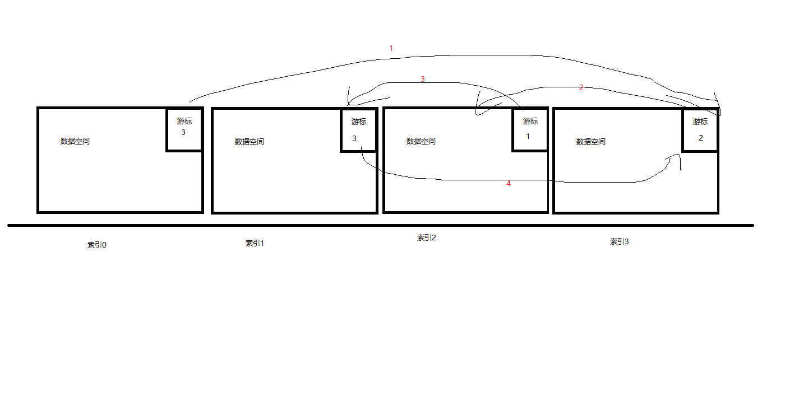

```java
/**
 * <p>Title : StaticLinkedList </p>
 * <p>Description : 静态链表</p>
 *
 * @author huifer
 * @date 2019-04-17
 */
public class StaticLinkedList {

    private static final int maxSize = 10;
    private StaticNode[] staticNodes = null;

    private int length;

    public StaticLinkedList() {
        this(maxSize);
    }

    public StaticLinkedList(int maxSize) {
        staticNodes = new StaticNode[maxSize];
        for (int i = 0; i < maxSize - 1; i++) {
            staticNodes[i] = new StaticNode(null, i + 1);
        }

        staticNodes[maxSize - 1] = new StaticNode(null, 0);

        this.length = 0;
    }


    public static void main(String[] args) {

        StaticLinkedList staticLinkedList = new StaticLinkedList();
        staticLinkedList.add(999, 1);
        staticLinkedList.add(777, 2);


        staticLinkedList.printAll();

        System.out.println();
    }

    public boolean isEmpty() {
        return length == 0;
    }

    public boolean isFull() {
        return length == maxSize;
    }

    /**
     * 插入数据
     */
    public void insert(Integer data) {
        int t = staticNodes[maxSize - 1].cur;
        int first = staticNodes[0].cur;

        staticNodes[maxSize - 1].cur = first;
        staticNodes[0].cur = staticNodes[first].cur;

        staticNodes[first].cur = t;
        staticNodes[first].data = data;
        length++;
    }

    public boolean add(Integer data, int index) {
        if (isFull() || index > maxSize || index < -1 || data == null) {
            return false;
        }
        if (index == 0) {
            insert(data);
            return true;
        }
        if (index > length) {
            index = length;
        }

        int firstUser = staticNodes[maxSize - 1].cur;
        int firstNull = staticNodes[0].cur;

        for (int i = 1; i < index; i++) {
            firstUser = staticNodes[firstUser].cur;
        }

        int nextUser = staticNodes[firstUser].cur;
        int nextNull = staticNodes[firstNull].cur;

        staticNodes[0].cur = nextNull;
        staticNodes[firstUser].cur = firstNull;
        staticNodes[firstNull].cur = nextUser;
        staticNodes[firstNull].data = data;
        return true;
    }

    public boolean deleteByData(Integer data) {
        if (isEmpty()) {
            return false;
        }
        int temp = maxSize - 1;
        while (temp != 0) {
            if (staticNodes[staticNodes[temp].cur].data.equals(data)) {
                int p = staticNodes[temp].cur;

                staticNodes[temp].cur = staticNodes[p].cur;
                staticNodes[p].cur = staticNodes[0].cur;
                staticNodes[0].cur = p;
                staticNodes[p].data = null;
                length--;
                return true;
            }
            temp = staticNodes[temp].cur;
        }
        return false;
    }

    public boolean deleteAll() {
        if (isEmpty()) {
            return true;
        }
        for (int i = 0; i < maxSize - 1; i++) {
            staticNodes[i].cur = i + 1;
            staticNodes[i].data = null;
        }
        staticNodes[maxSize - 1].cur = 0;
        staticNodes[maxSize - 1].data = null;

        length = 0;
        return true;
    }

    public void print() {
        int first = staticNodes[maxSize - 1].cur;

        for (int i = first; i != 0; ) {
            System.out.print(staticNodes[i].data + "\t");
            i = staticNodes[i].cur;
        }

    }


    public void printAll() {

        System.out.println("链表：");
        for (int i = 0; i < maxSize; i++) {
            System.out.print("[索引：" + i + " 数据：" + staticNodes[i].data + " 下一个cur：" + staticNodes[i].cur + "]");

        }

    }

}
```


##### 优缺点

- 优点
  - 删除修改操作只需要修改游标
- 缺点
  - 列表长度不确定
  - 失去了顺序存储结构随机存取的特性

#### 循环链表

##### 定义

- 将单链表中终端结点的指针端由空指针改为指向头结点，使整个单链表形成一个环，这种头尾相接的单链表称为单循环链表，简称循环链表。

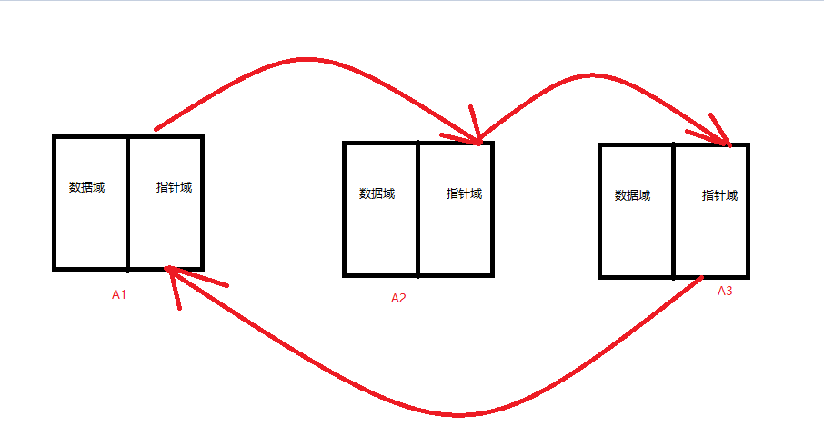

##### java实现

```java
public class CircularNode {

    public Integer data;
    public CircularNode next;

    public CircularNode(Integer data) {
        this.data = data;
    }

    public CircularNode() {
    }

    @Override
    public String toString() {
        final StringBuilder sb = new StringBuilder("{");
        sb.append("\"data\":")
                .append(data);
        sb.append(",\"next\":")
                .append(next);
        sb.append('}');
        return sb.toString();
    }
}
```


```java
public class CircularLinkedList {


    private CircularNode head;


    public CircularLinkedList() {
        head = new CircularNode();
        head.data = null;
        head.next = head;
    }

    public static void main(String[] args) {
        CircularLinkedList c = new CircularLinkedList();
        c.add(1);
        c.add(2);
        c.add(3);
        c.printall();

        c.delete(2);
        c.printall();

        CircularNode node = c.get(1);
        System.out.println(node);

    }

    public void add(Integer data) {
        CircularNode node = new CircularNode(data);
        if (head.next == head) {
            head.next = node;
            // 最后一个结点的指针域指向头
            node.next = head;
        } else {
            // // 找到最后一个元素进行追加
            CircularNode tem = head;
            while (tem.next != head) {
                tem = tem.next;
            }
            tem.next = node;
            node.next = head;
        }
    }

    public void delete(Integer data) {
        CircularNode tem = head;
        while (tem.next != head) {
            // 判断tem当前指向的结点数据是否和输入数据一样
            if (tem.next.data.equals(data)) {
                // 删除结点
                tem.next = tem.next.next;
            } else {
                // next指针后移
                tem = tem.next;
            }
        }
    }

    public CircularNode get(int i) {
        if (i < 0 || i > size()) {
            throw new IndexOutOfBoundsException();
        } else {
            int count = 0;
            CircularNode node = new CircularNode();
            CircularNode tem = head;
            while (tem.next != head) {
                count++;
                if (count == i) {
                    node.data = tem.next.data;
                }
                tem = tem.next;
            }
            return node;
        }
    }

    public int size() {
        CircularNode tem = head;
        int size = 0;
        // 当tem的指针域指向了head说明到了最后一个结点
        while (tem.next != head) {
            size++;
            tem = tem.next;
        }
        return size;
    }

    public void printall() {
        System.out.println("循环链表");
        CircularNode node = head;
        while (node.next != head) {

            node = node.next;
            System.out.print(node.data + "\t");

        }
        System.out.println();
    }
}
```


#### 双向链表

##### 定义

- 双向链表是单链表的每个结点中，再设置一个指向前驱结点的指针域，双向链表的指针域分别指向一个前驱，一个后继

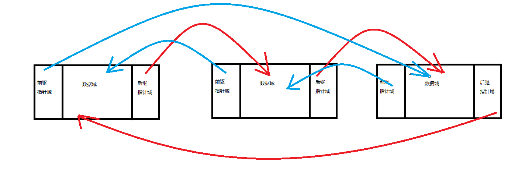

- 删除

  

  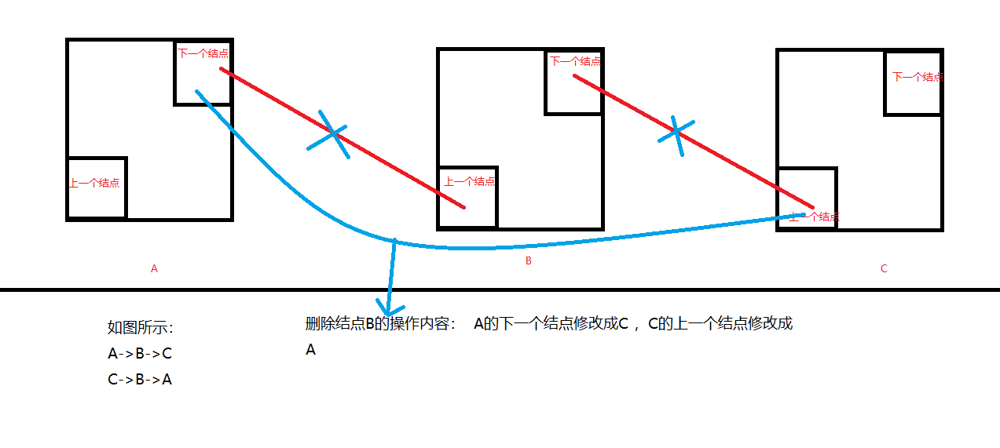

- 插入

  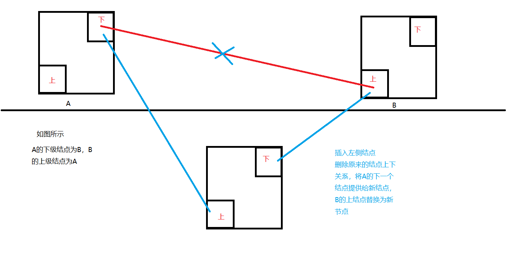

##### java实现

```java
package com.huifer.data.list.doubleLinkedList;

/**
 * <p>Title : DoubleNode </p>
 * <p>Description : 双线循环链表的结点</p>
 *
 * @author huifer
 * @date 2019-04-18
 */
public class DoubleNode {

    /**
     * 前一个结点
     */
    public DoubleNode prev = null;
    /**
     * 后一个结点
     */
    public DoubleNode next = null;

    /**
     * 数据
     */
    public Integer data;

    public DoubleNode() {
    }

    public DoubleNode(Integer data, DoubleNode prev, DoubleNode next) {

        this.prev = prev;
        this.next = next;
        this.data = data;
    }
}

```

```java
package com.huifer.data.list.doubleLinkedList;

/**
 * <p>Title : DoubleLinkedList </p>
 * <p>Description : 双向循环链表</p>
 *
 * @author huifer
 * @date 2019-04-18
 */
public class DoubleLinkedList {

    private DoubleNode first;
    private DoubleNode last;
    private int size = 0;

    public static void main(String[] args) {
        DoubleLinkedList d = new DoubleLinkedList();
        d.add(0);
        d.add(1);
        d.add(2);

        d.add(1, 999);
        d.delete(999);
        System.out.println();
    }

    public void add(Integer data) {
        addLast(data);
    }


    public boolean delete(Integer data) {
        if (data == null) {
            throw new RuntimeException("参数不能空");
        } else {
            for (DoubleNode d = first; d != null; d = d.next) {
                if (d.data.equals(data)) {
                    deleteNode(d);
                    return true;
                }
            }
        }
        return false;
    }

    private Integer deleteNode(DoubleNode d) {
        DoubleNode next = d.next;
        DoubleNode prev = d.prev;

        if (prev == null) {
            first = next;
        } else {
            // 当前结点上一个结点等与当前结点的下一个
            prev.next = next;
            d.prev = null;
        }

        if (next == null) {
            last = prev;
        } else {
            // 当前结点的下一个结点等与当前结点的上一个结点
            next.prev = prev;
            d.next = null;
        }

        d.data = null;
        size--;
        return d.data;
    }


    public DoubleNode get(int index) {
        return node(index);
    }


    private void addLast(Integer data) {
        // 原来的最后一个结点
        DoubleNode l = this.last;
        // 新增节点 ，新增节点的上一个结点是最后一个 没有下一个结点
        DoubleNode newNode = new DoubleNode(data, l, null);
        last = newNode;
        if (l == null) {
            // 如果最后一个结点等于空 那么只有一个结点 第一个结点等于新节点
            first = newNode;
        } else {
            // 否则l的下一个结点等于新节点
            l.next = newNode;
        }
        size++;
    }


    public void add(int index, Integer data) {
        if (!(index >= 0 && index <= size)) {
            throw new IndexOutOfBoundsException();
        }
        if (size == index) {
            addLast(data);
        } else {
            addbefor(data, node(index));
        }

    }


    private void addbefor(Integer data, DoubleNode node) {
        // 输入结点的上一个结点
        DoubleNode pred = node.prev;
        // 新节点构造   (数据， 上一个结点是输入结点的下一个，下一个结点时输入结点)
        DoubleNode newNode = new DoubleNode(data, pred, node);
        // 输入结点的下一个结点时新结点
        node.prev = newNode;
        if (pred == null) {
            first = newNode;
        } else {
            pred.next = newNode;
        }
        size++;
    }


    private DoubleNode node(int index) {
        // 一半一半的去查询找到这个结点
        if (index < (size >> 1)) {
            // 当index这个值小于总量的一半从头查询 反之从尾部开始
            DoubleNode d = first;
            for (int i = 0; i < index; i++) {
                d = d.next;
            }
            return d;
        } else {
            DoubleNode d = this.last;
            for (int i = size - 1; i < index; i--) {
                d = d.prev;
            }
            return d;
        }
    }


}
```

### 顺序存储结构和单链表的对比

| 对比内容 | 顺序存储结构           | 单链表       |
| -------- | ---------------------- | ------------ |
| 存储     | 用连续的储存单元来存放 | 任意粗存单元 |
| 查询     | O(1)                   | O(n)         |
| 插入删除 | O(n)                   | O(n)         |

- 线性表需要频繁查找用顺序储存
- 线性表需要频繁插入删除用单链表
- 线性表中元素数量不确定的时候用单链表

### 总结

```mermaid
graph TD
线性表 --> 顺序存储结构
线性表 --> 链式存储结构
链式存储结构-->单链表
链式存储结构-->静态链表
链式存储结构-->循环链表
链式存储结构-->双向链表


```


---------------------


