# 树

## 树定义

> 树是n个结点的有限集。n=0时称为空树。在任意一棵非空树中：
>
> 1. 有且仅有一个特定的根（ROOT）结点
> 2. 当n>1时，其余结点可分为m个互不相交的有限集，其中每个集合本身优势一棵树，且称为根的子树

- 图中蓝色框内为子树

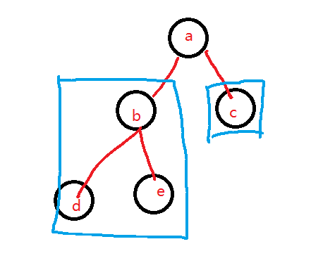

## 结点的度

> 结点拥有的子节点数称为度

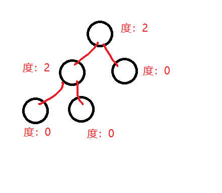

## 结点层次

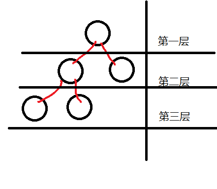

## 树的抽象数据结构

```
ADT 树(Tree)
Data
	树是由一个根结点和若干棵子树构成。树中结点具有相同数据类型及层次关系
	
Operation
	initTree(*T):    构造空树T
	destroyTree(*T):    销毁树T
	createTree(*T,definition):    按照definition给出的定义来构造树T
	clearTree(*T):    清空树T
	treeEmpty(T):    若树T为空树，返回true，否则返回false
	treeDepth(T):    返回树T的深度
	root(T):    返回树T的根节点
	Value(T,cur_e):    cur_e是树T中一个结点，返回该节点的值
	Assign(T,cur_e,value):    将结点cur_e赋值为value
	parent(T,cur_e):    若cur_e不是根节点，返回双亲结点，否则返回空
	leftChild(T,cur_e):    若cur_e是书的非叶结点，返回他最左侧的结点，否则返回空
	rightSibling(T,cur_e):    若cur_e由右兄弟，则返回右兄弟，否则返回空
	insertChild(*T,*p,i,c):    p指向树T的一个结点，i为所致结点p的度+1,非空树c与T不相交，操作结果为插入c为树T中p结点的第i棵子树
	deleteChild(*T,*p,i):    配置项树T的一个结点，i为p的度，操作结果为删除T中p指向结点的第i棵树
	
endADT

```


## 二叉树

> 一棵深度为k，且有2^k-1个节点的二叉树，称为满二叉树。这种树的特点是每一层上的节点数都是最大节点数。而在一棵二叉树中，除最后一层外，若其余层都是满的，并且最后一层或者是满的，或者是在右边缺少连续若干节点，则此二叉树为完全二叉树。具有n个节点的完全二叉树的深度为floor(log2n)+1。深度为k的完全二叉树，至少有2k-1个叶子节点，至多有2k-1个节点。

### 二叉树特点

- 每个结点**最多有2棵子树**，所以二叉树中不存在度大于2的结点。子树数量<=2
- 左子树和右子树是有顺序的，次序不能任意颠倒

- 即使树中某些结点只有一棵树也要区分左子树和右子树

### 二叉树的基本形态


1. 空二叉树
2. 只有一个根节点
3. 根节点只有左子树
4. 根节点只有右子树
5. 根节点既有左子树又有右子树

### 特殊二叉树

#### 斜树	

   - 所有的结点都只有左子树的二叉树称为左斜树
   - 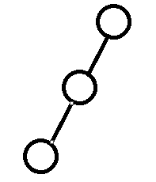
   - 所有的结点都只有右子树的二叉树称为右斜树
        - 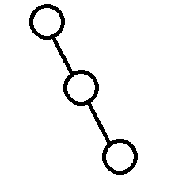


#### 满二叉树

   - 在一棵二叉树中，如果所有分支结点都存在左子树和右子树，并且所有叶子都在同一层上，这样的二叉树称为满二叉树

        - 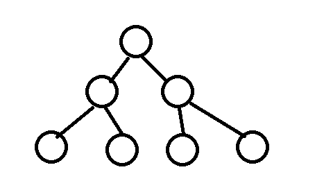

​     

#### 完全二叉树

   - 对一棵具有n个结点的二叉树按层序编号,如果编号为i($$1 \leq i \leq n$$) 的结点与同样圣都的满二叉树中编号为i的结点在二叉树中位置相同，则这棵二叉树称为完全二叉树

        - 

          

​	

### 二叉树的性质

1. 二叉树的第 i 层上至多有 $2^{i-1}  (i\geq1)$个结点
2. 深度为k的二叉树至多有$2^{k}-1  (k\geq1) $ 个结点
3. 对任何一棵二叉树T，如果其终端结点数为n<sub>0</sub> 度为2的结点数为 n<sub>2</sub> 则$n_0=n_2+1$
4. 具有n个结点的完全二叉树深度为$\log(2)n+1$

### 二叉树的存储

#### 二叉树的顺序存储

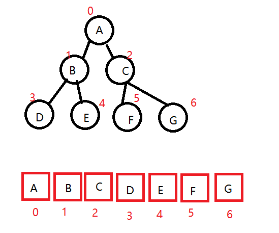

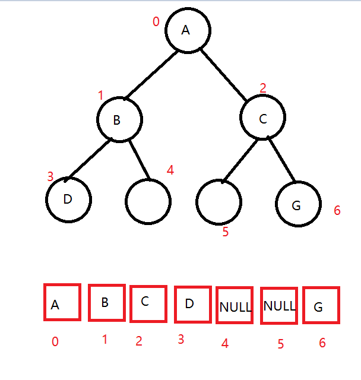

#### 二叉树的链表存储


### 二叉树的遍历

#### 前序遍历

- 若二叉树不为空，先访问根结点，依次访问左节点知道没有，在进行右节点访问
- 根结点 ---> 左子树 ---> 右子树

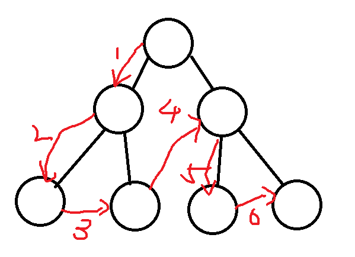

#### 中序遍历

- 左子树---> 根结点 ---> 右子树

  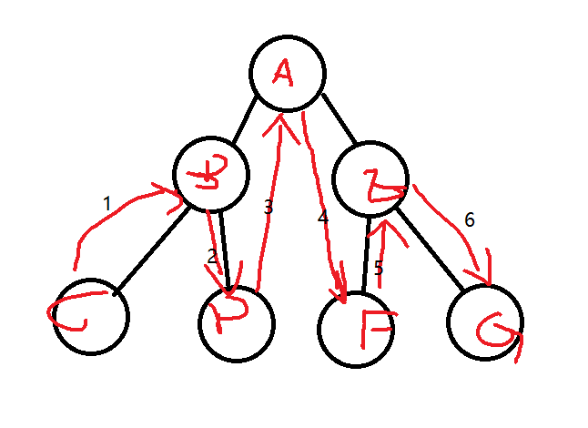

#### 后序遍历

- 左子树 ---> 右子树 ---> 根结点

  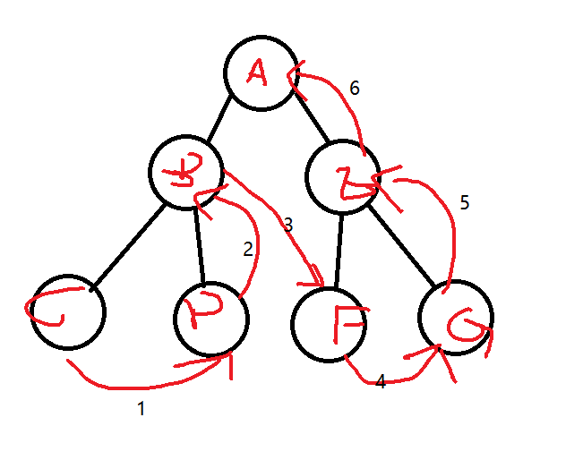

#### 层次遍历

- 一层一层遍历

  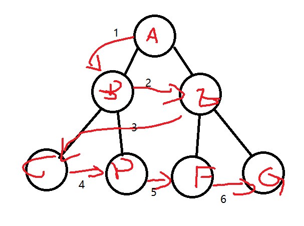


## 树的实现

- 树节点设计 ，具有数据域，左侧指针，右侧指针 如下图所示


```java
public class TreeNode<T> {

    T data;
    TreeNode<T> leftChild;
    TreeNode<T> rightChild;

    public TreeNode(T data) {
        this.data = data;
    }

    public TreeNode() {
    }

    /**
     * 左节点增加
     * @param data
     */
    public void addLeft(T data) {
        TreeNode<T> left = new TreeNode<>(data);
        this.leftChild = left;
    }

    /**
     * 右节点增加
     * @param data
     */
    public void addRight(T data) {
        TreeNode<T> right = new TreeNode<>(data);
        this.rightChild = right;
    }


}
```

```java
package com.huifer.data.tree;

import java.util.LinkedList;
import java.util.Queue;


/**
 * <p>Title : TreeTools </p>
 * <p>Description : 树处理工具</p>
 *
 * @author huifer
 * @date 2019-04-28
 */
public class TreeTools {

    public static void main(String[] args) {
        TreeNode<Integer> tree = new TreeNode<>(1);
        tree.addLeft(2);
        tree.addRight(3);
        tree.leftChild.addRight(4);
        tree.rightChild.addRight(5);
        System.out.println("节点数量");
        System.out.println(TreeTools.getTreeSize(tree));
        System.out.println("树的深度");
        System.out.println(TreeTools.getTreeDepth(tree));
        System.out.println("前序遍历");
        preOrderTravel(tree);
        System.out.println("中序遍历");
        inorderTraversal(tree);
        System.out.println("后序遍历");
        postorderTraversal(tree);
        System.out.println("分层遍历");
        levelTravel(tree);
        System.out.println("K层节点数量");
        int numForKLevel = getNumForKLevel(tree, 2);
        System.out.println(numForKLevel);


        TreeNode<String> T2 = new TreeNode<>("A");
        T2.addLeft("B");
        T2.leftChild.addLeft("D");
        T2.leftChild.leftChild.addLeft("G");
        T2.leftChild.leftChild.addRight("H");

        T2.addRight("C");
        T2.rightChild.addLeft("E");
        T2.rightChild.addRight("F");
        T2.rightChild.leftChild.addRight("I");
        System.out.println("前序遍历");
        preOrderTravel(T2);
        System.out.println("中序遍历");
        inorderTraversal(T2);
        System.out.println("后序遍历");
        postorderTraversal(T2);
        System.out.println("层次遍历");
        levelTravel(T2);
        System.out.println();


    }

    /**
     * 获取树的节点数量
     *
     * @param root 根节点
     * @return 节点数量
     */
    public static <T> int getTreeSize(TreeNode<T> root) {
        if (root == null) {
            return 0;
        }
        return getTreeSize(root.leftChild) + getTreeSize(root.rightChild) + 1;
    }

    /**
     * 获取树的深度
     *
     * @param root 根节点
     * @return 深度
     */
    public static <T> int getTreeDepth(TreeNode<T> root) {
        if (root == null) {
            return 0;
        }
        int leftDepth = getTreeDepth(root.leftChild) + 1;
        int rightDepth = getTreeDepth(root.rightChild) + 1;
        return Math.max(leftDepth, rightDepth);
    }


    /**
     * 输出结点的数据
     *
     * @param node 结点
     */
    private static <T> void printNodeValue(TreeNode<T> node) {
        System.out.println(node.data + "\t");
    }

    /**
     * 前序遍历，注: 中序遍历 后序遍历将print位置调整即可
     */
    public static <T> void preOrderTravel(TreeNode<T> root) {
        if (root == null) {
            return;
        }
        printNodeValue(root);
        preOrderTravel(root.leftChild);
        preOrderTravel(root.rightChild);
    }

    /**
     * 中序遍历，注: 中序遍历 后序遍历将print位置调整即可
     */
    public static <T> void inorderTraversal(TreeNode<T> root) {
        if (root == null) {
            return;
        }
        inorderTraversal(root.leftChild);
        printNodeValue(root);
        inorderTraversal(root.rightChild);
    }

    /**
     * 后序遍历，注: 中序遍历 后序遍历将print位置调整即可
     */
    public static <T> void postorderTraversal (TreeNode<T> root) {
        if (root == null) {
            return;
        }
        postorderTraversal(root.leftChild);
        postorderTraversal(root.rightChild);
        printNodeValue(root);
    }


    /**
     * 分层遍历
     */
    public static <T> void levelTravel(TreeNode<T> root) {
        Queue<TreeNode<T>> queue = new LinkedList<>();
        queue.offer(root);
        while (!queue.isEmpty()) {
            TreeNode<T> tem = queue.poll();
            printNodeValue(tem);
            if (tem.leftChild != null) {
                queue.offer(tem.leftChild);
            }
            if (tem.rightChild != null) {
                queue.offer(tem.rightChild);
            }
        }
    }

    /**
     * 返回k层的结点个数
     */
    public static <T> int getNumForKLevel(TreeNode<T> root, int k) {
        if (root == null || k < 1) {
            return 0;
        }
        if (k == 1) {
            return 1;
        }

        int leftNum = getNumForKLevel(root.leftChild, k - 1);
        int rightNum = getNumForKLevel(root.rightChild, k - 1);

        return leftNum + rightNum;
    }


}

```
